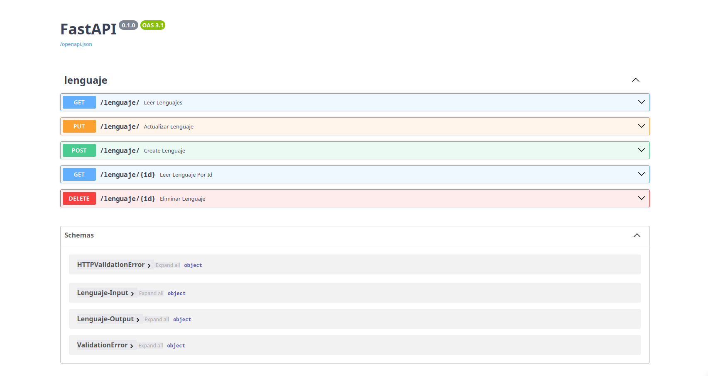
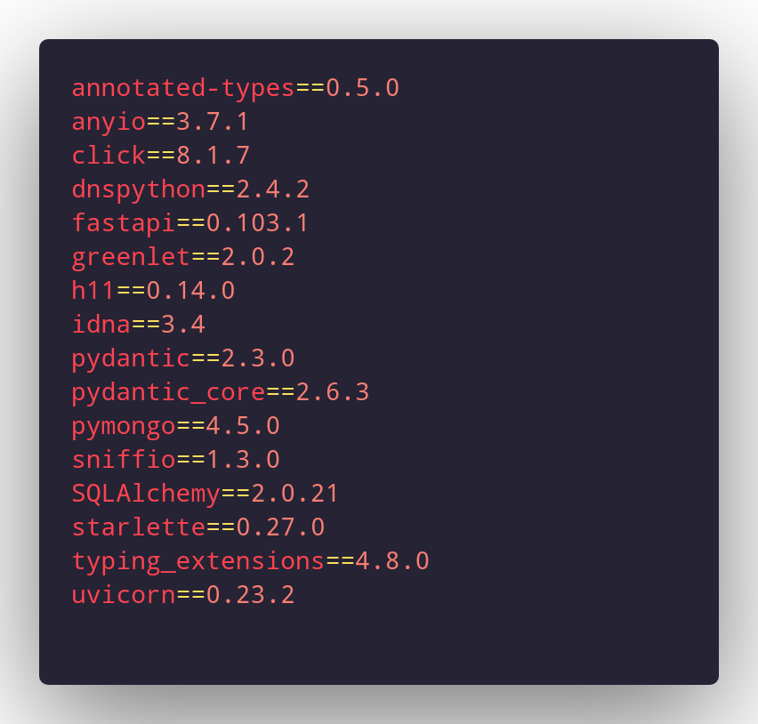

# API REST en FastAPI usando MongoDB

Esta API REST fue desarrollada utilizando FastAPI en Python y se conecta a una base de datos MongoDB. Proporciona operaciones CRUD (Crear, Leer, Actualizar y Eliminar) para gestionar libros y prestamos.

1. [Descripción](#descripción)
2. [Endpoints de la API](#endpoints-de-la-api)
3. [Paquetes de la API](#paquetes-de-la-api)

    3.1 [db](#db)

    3.2 [db-models](#db-models)

    3.3 [routers](#routers)

    3.4 [db-schemas](#db-schemas)

    3.5 [main.py](#main)

4. [Funcionalidades](#funcionalidades)
5. [Capturas de Pantalla](#capturas-de-pantalla)
6. [Requisitos](#requisitos)
7. [Instalación](#instalación)
8. [Uso](#uso)
9. [Contribución](#contribución)

## Descripción
Esta API REST está diseñada para gestionar información relacionada con los lenguajes de programacion. Esta documentación te guiará a través de los paquetes y funcionalidades clave de la API.

## Endpoints de la API

A continuación se muestra un resumen de los endpoints disponibles en la API:

| Endpoint                | Método | Descripción                                      |
|-------------------------|--------|--------------------------------------------------|
| `/lenguaje/`                | GET    | Obtiene la lista de todos los lenguajes.         |
| `/lenguaje/`                | POST   | Crea un nuevo lenguaje.                          |
| `/lenguaje/{id}`      | GET    | Obtiene la información de un lenguaje por su ID. |
| `/lenguaje/`               | PUT    | Actualiza la información de un lenguaje existente.|
| `/lenguaje/{id}`      | DELETE | Elimina un lenguaje por su ID.                   |

## Paquetes de la API

### db

client.py: Este módulo contiene la configuración y la conexión a la base de datos MongoDB utilizada por la API.

### db models

lenguaje.py: Define el modelo de datos para los lenguajes, incluyendo atributos como el nombre, el creador y otros detalles relevantes.

### routers

lenguaje.py: Este módulo contiene los endpoints básicos para operaciones CRUD (Crear, Leer, Actualizar y Borrar) relacionadas con los lenguajes.

### db schemas

lenguaje.py: Define los esquemas de datos (schemas) utilizados para validar y serializar los datos de los lenguajes.

### app.py

Este archivo incluye la configuración principal de la aplicación FastAPI y agrupa los routers para los recursos de lenguajes. Es el punto de entrada de la aplicación.

## Funcionalidades

La API ofrece las siguientes funcionalidades:

### Lenguaje:
Crear un nuevo lenguaje. Leer la información de un lenguaje por su ID. Actualizar la información de un lenguaje existente, Eliminar un lenguaje.


## Capturas de Pantalla


*Vista en Swagger de las APIs*

## Requisitos

Antes de utilizar esta API, asegúrate de tener los siguientes requisitos:

* Python 3.11 o superior.

* Bibliotecas Python requeridas (instaladas automáticamente durante la instalación). Puedes instalarlas utilizando el archivo requirements.txt, que contiene las siguientes dependencias:


*requirements.txt*

## Instalación

1. Clona este repositorio en tu máquina local:

``` bash
git clone https://github.com/tu-usuario/tu-repo.git
```

2. Accede al directorio del proyecto:

``` bash
cd tu-repo
```

3. Crea un entorno virtual (recomendado):

``` bash
python -m venv venv
```

4. Activa el entorno virtual:

* En Windows:

``` bash
venv\Scripts\activate
```

* En macOS y Linux:
    
``` bash
source venv/bin/activate
```

5. Instala las dependencias del proyecto:

``` bash
pip install -r requirements.txt
```

## Uso

Para ejecutar la API, asegúrate de estar en el directorio del proyecto y de tener el entorno virtual activado (si lo creaste). Luego, ejecuta el siguiente comando:

``` bash
uvicorn main:app --reload
```

La API estará disponible en http://localhost:8000/docs.

## Contribución

Si deseas contribuir a este proyecto, por favor sigue estos pasos:

1. Realiza un fork del repositorio.
2. Crea una rama con tu nueva característica o corrección: git checkout -b mi-caracteristica.
3. Realiza tus cambios y haz commits: git commit -m 'Agrega nueva característica'.
4. Sube tus cambios a tu repositorio en GitHub: git push origin mi-caracteristica.
5. Crea un Pull Request en el repositorio original.
